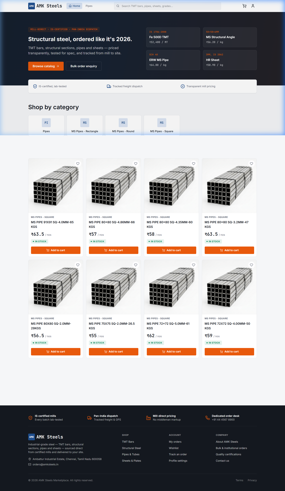
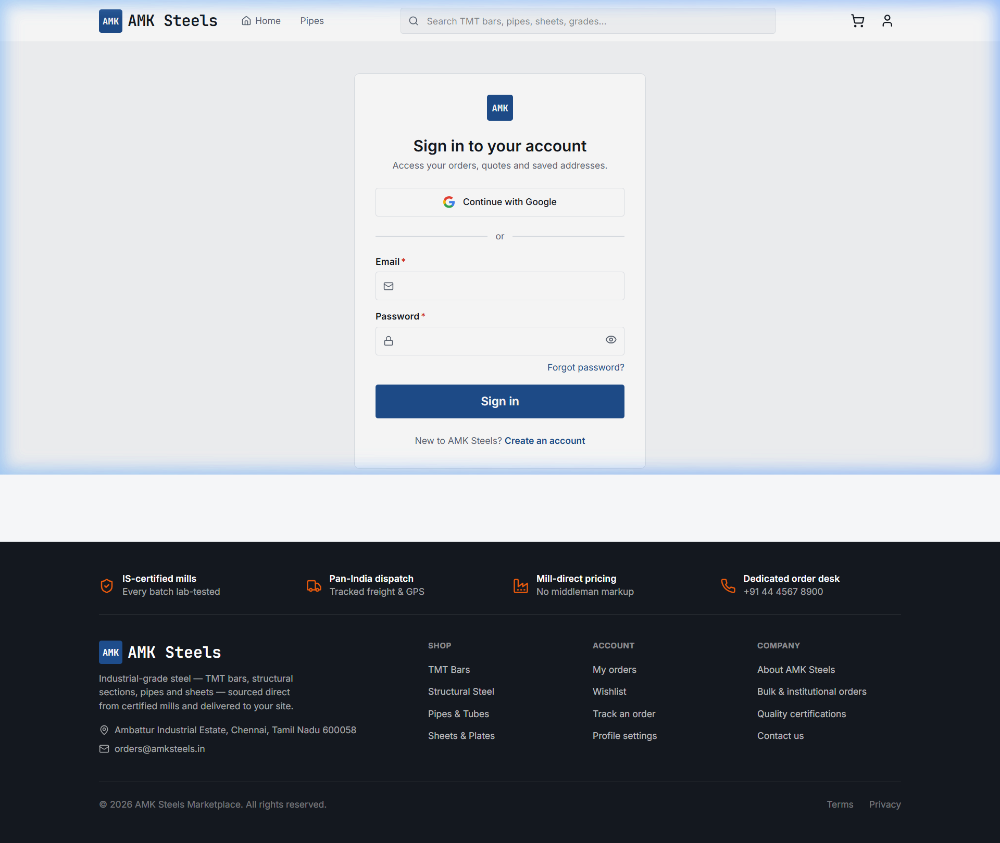
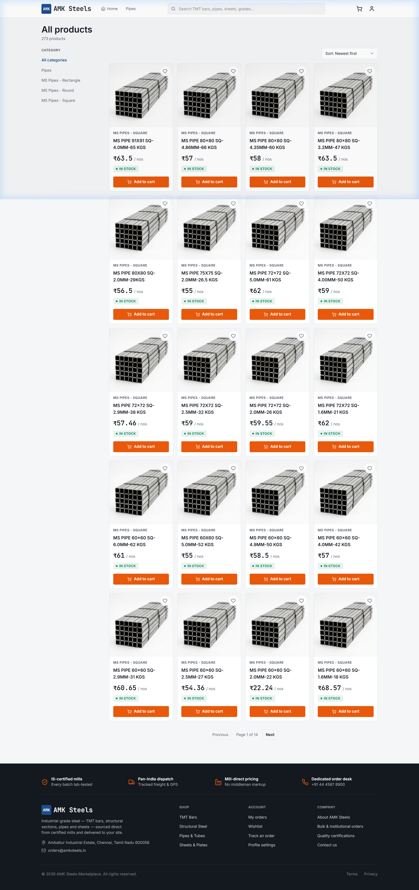

<div align="center">

# 🏗️ AMK Steels — Industrial Steel E-Commerce Platform

**A production-grade B2C/B2B marketplace for industrial steel products**

[](https://amk-steels.vercel.app)
[](./LICENSE)
[](https://nodejs.org)
[](https://react.dev)
[](https://postgresql.org)

*TMT bars, structural steel, pipes, sheets, coils, angles, channels, wire products — think Amazon or Flipkart, but for steel.*

Ships as both a **responsive website** and a **signed Android APK** from a single React codebase.

</div>

---

## 📸 Screenshots

<div align="center">

### Homepage


### Authentication


### Product Catalog


</div>

---

## ✨ Key Features

### 🛒 Customer Experience
- **Product Catalog** — Browse 273+ real steel products with specifications, pricing, and stock status
- **Smart Search** — Search by product name, grade, specifications, or SKU
- **Category Navigation** — Pipes (Round, Square, Rectangle), TMT Bars, Structural Steel, Sheets & Plates
- **Shopping Cart** — Real-time stock validation, minimum order quantity enforcement
- **Wishlist** — Save products for later
- **Order Tracking** — Full lifecycle: Pending → Confirmed → Processing → Shipped → Delivered

### 💳 Payments & Billing
- **Razorpay Integration** — Secure payment processing with HMAC signature verification
- **Billing Receipts** — Automated email receipts sent after successful payment
- **Order Cancellation** — Automatic Razorpay refund + inventory restoration

### 🔐 Authentication & Security
- **Multi-method Auth** — Email/password, Google Sign-In, Phone OTP
- **JWT with Rotation** — Short-lived access tokens (15min) + rotating refresh tokens (30 days)
- **Argon2id Hashing** — OWASP-recommended password hashing with bcrypt auto-migration
- **reCAPTCHA v3** — Bot protection on all auth endpoints
- **Rate Limiting** — Auth: 15 req/15min, API: 200 req/15min

### 👨‍💼 Admin Dashboard
- **Analytics Dashboard** — Revenue, orders, inventory metrics, top-selling products
- **Product Management** — CRUD with dynamic specifications builder
- **Inventory Control** — Real-time stock management by warehouse
- **Order Fulfillment** — Status transitions with automatic tracking events
- **User Management** — Role elevation, account status controls

### 📱 Mobile App
- **Android APK** — Native hybrid app via Capacitor (same React codebase)
- **Google Sign-In** — Native account picker integration
- **Status Bar** — Properly configured for Android notch/status bar
- **Hardware Back Button** — Navigate back or exit app cleanly

---

## 🏛️ Architecture

```
┌──────────────────────────────────────────────────────────┐
│               Frontend (React 19 SPA)                     │
│     Vite · TailwindCSS v4 · Zustand · React Query        │
│     Deploy: Vercel (web) + Capacitor (Android APK)        │
└─────────────────────────┬────────────────────────────────┘
                          │ REST API (Bearer JWT)
┌─────────────────────────┴────────────────────────────────┐
│              Backend (Node.js + Express 5)                 │
│   Dual Prisma Clients · Razorpay · Resend · Firebase      │
│              Deploy: Render                                │
└──────────┬──────────────────────────────┬────────────────┘
           │                              │
   ┌───────┴────────┐            ┌────────┴───────┐
   │   amk_auth     │            │  amk_catalog   │
   │   PostgreSQL   │            │  PostgreSQL    │
   │                │            │                │
   │  • Users       │            │  • Products    │
   │  • Orders      │            │  • Categories  │
   │  • Cart        │            │  • Inventory   │
   │  • Addresses   │            │  • Warehouses  │
   │  • Reviews     │            │  • Price Hist. │
   │  • Wishlist    │            │                │
   └────────────────┘            └────────────────┘
        Neon Serverless               Neon Serverless
```

### Why Dual Databases?
- **Security Isolation** — User credentials and financial data are physically separated from product catalog
- **Independent Scaling** — Catalog reads (browsable by anyone) scale independently from transactional writes
- **Cross-DB Checkout** — Atomic stock reservation via compensating transactions (see below)

---

## 🔄 Cross-Database Checkout Algorithm

The checkout system implements a **Two-Phase Atomic Stock Reservation with Compensating Transactions** to maintain consistency across two databases:

```
           [ Client Checkout Request ]
                       │
                       ▼
       ┌───────────────────────────────┐
       │ 1. Validate User & Addresses  │  ← amk_auth
       └───────────────┬───────────────┘
                       ▼
       ┌───────────────────────────────┐
       │ 2. Read Catalog & Stock Info  │  ← amk_catalog
       └───────────────┬───────────────┘
                       ▼
       ┌───────────────────────────────┐
       │ 3. PHASE 1: Reserve Stock     │  ← amk_catalog
       │    WHERE qty_available >= req  │
       └───────────────┬───────────────┘
                       │
            ┌──────────┴──────────┐
            │ Success             │ Race Condition
            ▼                     ▼
┌───────────────────────┐ ┌─────────────────────┐
│ 4. PHASE 2: Create    │ │ Compensate & Restore│
│    Order in amk_auth  │ │ Reserved Stock      │
└───────────┬───────────┘ └─────────────────────┘
            │
   ┌────────┴────────┐
   │ Success         │ Failure
   ▼                 ▼
[ Return Order ] [ Compensate & Throw ]
```

---

## 🛠️ Tech Stack

| Layer | Technology |
|-------|-----------|
| **Frontend** | React 19, Vite 6, TailwindCSS v4, Zustand, React Query v5, React Router v7 |
| **Backend** | Node.js 20, Express 5, Prisma ORM (dual clients), Zod v4 validation |
| **Database** | PostgreSQL 16 (Neon Serverless) — 2 isolated databases |
| **Auth** | JWT (access + refresh with rotation), Google Sign-In (Firebase), Phone OTP |
| **Payments** | Razorpay (HMAC SHA-256 verified) |
| **Email** | Resend (transactional emails, billing receipts) |
| **Mobile** | Capacitor 7 (Android APK from same codebase) |
| **Security** | Helmet, CORS, reCAPTCHA v3, express-rate-limit, Argon2id |
| **Deploy** | Vercel (frontend), Render (backend), Neon (databases) |
| **Dev Tools** | Docker Compose, Nodemon, MSW (mock service worker) |

---

## 📦 Project Structure

```
amk-steels/
├── backend/
│   ├── prisma/
│   │   ├── auth/schema.prisma        # Users, orders, cart, reviews, wishlist
│   │   └── catalog/schema.prisma     # Products, categories, inventory, warehouses
│   ├── scripts/
│   │   ├── seed-admin.js             # Seeds first admin from env vars
│   │   ├── import-products.js        # Imports 273 real products from Excel
│   │   └── init-db.sql               # Creates databases and scoped users
│   ├── src/
│   │   ├── config/                   # Database clients, env validation, Firebase Admin
│   │   ├── controllers/              # auth, admin, cart, order, product, payment, user, wishlist, otp
│   │   ├── middleware/               # requireAuth, requireAdmin, validate, rateLimiter, recaptcha
│   │   ├── routes/                   # Express route definitions
│   │   ├── schemas/                  # Zod validation schemas
│   │   └── services/                 # auth, checkout, email, payment, otp
│   ├── .env.example                  # All 16 env vars documented
│   └── package.json
├── frontend/
│   ├── android/                      # Capacitor Android project
│   ├── src/
│   │   ├── api/                      # Axios client with silent token refresh
│   │   ├── components/               # UI (Button, Modal, Toast, Spinner, etc.)
│   │   ├── config/firebase.js        # Firebase web SDK config
│   │   ├── hooks/                    # useCart, useOrders, useProducts, useRecaptcha, etc.
│   │   ├── pages/                    # All customer + admin pages
│   │   ├── stores/                   # Zustand (authStore, cartStore, toastStore)
│   │   └── utils/                    # Google Auth, product helpers
│   ├── .env.example                  # Frontend env vars documented
│   └── capacitor.config.json
├── docs/screenshots/                 # Application screenshots
├── docker-compose.yml                # Local dev environment
├── LICENSE                           # MIT License
├── PROJECT_DOCUMENTATION.md          # Full technical documentation (570+ lines)
└── README.md                         # This file
```

---

## 🚀 Getting Started

### Prerequisites
- **Node.js** 20+ and npm
- **PostgreSQL** 16+ (or Docker)

### 1. Clone & Install

```bash
git clone https://github.com/Boovesh985/Steel-E-Commerce-platform.git
cd Steel-E-Commerce-platform

# Install backend dependencies
cd backend && npm install

# Install frontend dependencies
cd ../frontend && npm install
```

### 2. Configure Environment

```bash
# Backend — copy and fill in your credentials
cp backend/.env.example backend/.env

# Frontend — copy and fill in your public keys
cp frontend/.env.example frontend/.env
```

<details>
<summary><b>📋 Backend Environment Variables</b></summary>

| Variable | Description |
|----------|-------------|
| `AUTH_DATABASE_URL` | PostgreSQL connection string for `amk_auth` database |
| `CATALOG_DATABASE_URL` | PostgreSQL connection string for `amk_catalog` database |
| `JWT_ACCESS_SECRET` | 256-bit random hex string for access tokens |
| `JWT_REFRESH_SECRET` | 256-bit random hex string for refresh tokens |
| `RAZORPAY_KEY_ID` | Razorpay merchant API key |
| `RAZORPAY_KEY_SECRET` | Razorpay merchant secret |
| `RESEND_API_KEY` | Resend transactional email API key |
| `RECAPTCHA_SECRET_KEY` | Google reCAPTCHA v3 secret key |
| `FIREBASE_SERVICE_ACCOUNT_PATH` | Path to Firebase Admin SDK JSON |
| `ADMIN_EMAIL` / `ADMIN_PASSWORD` | Initial admin account credentials |
| `FRONTEND_URL` / `CORS_ORIGIN` | Frontend domain for CORS and email links |

</details>

<details>
<summary><b>📋 Frontend Environment Variables</b></summary>

| Variable | Description |
|----------|-------------|
| `VITE_API_BASE_URL` | Backend API URL (e.g., `http://localhost:4000/api`) |
| `VITE_RAZORPAY_KEY_ID` | Razorpay publishable key |
| `VITE_RECAPTCHA_SITE_KEY` | reCAPTCHA v3 site key |
| `VITE_FIREBASE_API_KEY` | Firebase web API key |
| `VITE_FIREBASE_AUTH_DOMAIN` | Firebase auth domain |
| `VITE_FIREBASE_PROJECT_ID` | Firebase project ID |

</details>

### 3. Database Setup

```bash
# Option A: Docker (recommended)
docker-compose up -d postgres

# Option B: Manual PostgreSQL
psql -f backend/scripts/init-db.sql
```

### 4. Generate Prisma Clients & Seed Data

```bash
cd backend
npm run setup
# This runs: prisma generate → db push → seed admin → import 273 products
```

### 5. Run Development Servers

```bash
# Terminal 1: Backend API (port 4000)
cd backend && npm run dev

# Terminal 2: Frontend (port 5173)
cd frontend && npm run dev
```

Visit **http://localhost:5173** 🚀

### 6. Build Android APK

```bash
cd frontend
VITE_BASE="./" npm run build
npx cap sync android
cd android && ./gradlew assembleRelease
```

---

## 🔒 Security Features

| Feature | Implementation |
|---------|---------------|
| **Password Hashing** | Argon2id (64MiB, 3 iterations, parallelism 4) with automatic bcrypt migration |
| **JWT Auth** | Access token (15min) + refresh token (30 days) with rotation on each refresh |
| **Token Storage** | Refresh tokens stored as SHA-256 hashes in DB, revocable on logout |
| **reCAPTCHA v3** | Applied to register, login, Google auth, forgot-password (bypassed for Capacitor) |
| **Rate Limiting** | Auth: 15 req/15min, General API: 200 req/15min |
| **Input Validation** | Zod schemas on every POST/PUT route, phone/email/GSTIN/pincode format validation |
| **CORS** | Explicit origin allowlist + Capacitor scheme support |
| **Helmet** | Security headers (CSP, XSS Protection, HSTS, etc.) |
| **SQL Injection** | Prisma ORM parameterized queries + `$queryRaw` tagged templates |
| **Admin Protection** | Role-based middleware, self-role-change prevention, last-admin guard |

---

## 📡 API Endpoints

<details>
<summary><b>Authentication (8 endpoints)</b></summary>

| Method | Endpoint | Description |
|--------|----------|-------------|
| POST | `/api/auth/register` | Register with email/password + phone |
| POST | `/api/auth/login` | Email/password login |
| POST | `/api/auth/google` | Firebase Google Sign-In |
| POST | `/api/auth/refresh` | Rotate access + refresh tokens |
| POST | `/api/auth/logout` | Revoke refresh token |
| POST | `/api/auth/forgot-password` | Send password reset email |
| POST | `/api/auth/reset-password` | Reset password with token |
| POST | `/api/otp/send` | Send phone OTP via Firebase |

</details>

<details>
<summary><b>Products & Categories (5 endpoints)</b></summary>

| Method | Endpoint | Description |
|--------|----------|-------------|
| GET | `/api/products` | Paginated product listing with filters |
| GET | `/api/products/:slug` | Product detail with specs, images, stock |
| GET | `/api/products/search` | Full-text search |
| GET | `/api/categories` | Category tree (parent + children) |
| GET | `/api/categories/:slug` | Products by category |

</details>

<details>
<summary><b>Cart, Orders, Payments (10 endpoints)</b></summary>

| Method | Endpoint | Description |
|--------|----------|-------------|
| GET | `/api/cart` | Get user's cart with items |
| POST | `/api/cart/items` | Add item (stock-validated) |
| PUT | `/api/cart/items/:id` | Update quantity |
| DELETE | `/api/cart/items/:id` | Remove item |
| POST | `/api/orders/checkout` | Cross-DB atomic checkout |
| GET | `/api/orders` | User's order history |
| GET | `/api/orders/:id` | Order detail with tracking |
| POST | `/api/orders/:id/cancel` | Cancel + auto refund |
| POST | `/api/payments/create-order` | Create Razorpay order |
| POST | `/api/payments/verify` | HMAC signature verification |

</details>

<details>
<summary><b>Admin (12+ endpoints)</b></summary>

| Method | Endpoint | Description |
|--------|----------|-------------|
| GET | `/api/admin/dashboard` | Analytics summary |
| GET/POST | `/api/admin/products` | List / create products |
| PUT/DELETE | `/api/admin/products/:id` | Update / delete |
| GET | `/api/admin/orders` | All orders (filtered) |
| PUT | `/api/admin/orders/:id/status` | Update status + tracking |
| GET | `/api/admin/inventory` | Stock levels, low-stock alerts |
| PUT | `/api/admin/inventory/:id` | Adjust stock |
| GET | `/api/admin/users` | User management |
| PUT | `/api/admin/users/:id/role` | Change user role |

</details>

---

## 🚢 Deployment

| Service | Platform | URL |
|---------|----------|-----|
| **Frontend** | Vercel | [amk-steels.vercel.app](https://amk-steels.vercel.app) |
| **Backend API** | Render | amk-steels-api.onrender.com |
| **Auth Database** | Neon | `amk_auth` (ap-southeast-1) |
| **Catalog Database** | Neon | `amk_catalog` (ap-southeast-1) |
| **Android APK** | Signed release | 16.7 MB |

---

## 📚 Documentation

For comprehensive technical documentation covering database schemas, API reference, checkout algorithm, payment flow, and deployment infrastructure, see:

📄 **[PROJECT_DOCUMENTATION.md](./PROJECT_DOCUMENTATION.md)** (570+ lines of detailed documentation)

---

## 🤝 Contributing

1. Fork the repository
2. Create your feature branch (`git checkout -b feature/amazing-feature`)
3. Commit your changes (`git commit -m 'Add amazing feature'`)
4. Push to the branch (`git push origin feature/amazing-feature`)
5. Open a Pull Request

---

## 📄 License

This project is licensed under the **MIT License** — see the [LICENSE](./LICENSE) file for details.

---

<div align="center">

**Built with ❤️ by [T Booveshwaran](https://github.com/Boovesh985)**

⭐ Star this repo if you found it useful!

</div>
